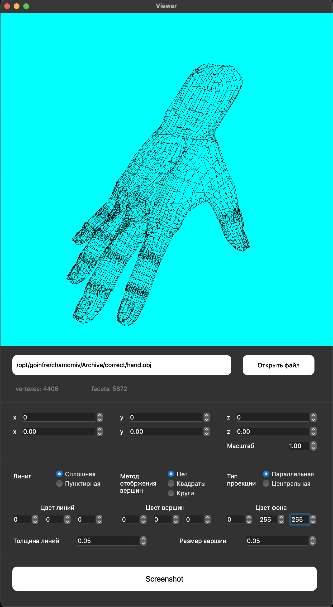
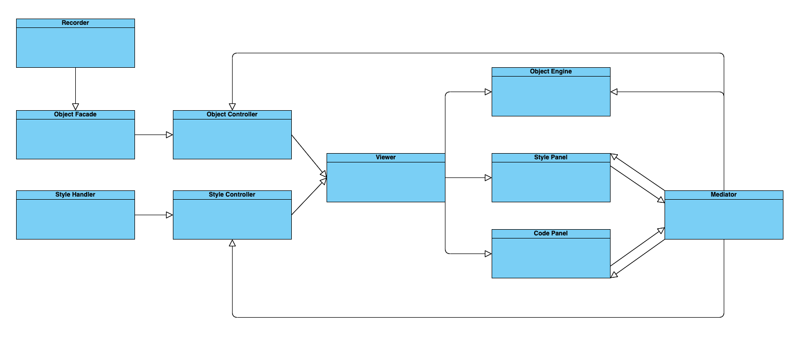

# 3DViewer Application

## Table of Contents

1. [Chapter I - Project Architecture](#chapter-i) \
    1.1. [Introduction](#introduction)
2. [Chapter II - Information](#chapter-ii) \
    2.1. [Design Patterns](#design-patterns)
3. [Chapter III - Program Features](#chapter-iii) \
    3.1. [Part 1 - 3D_Viewer](#part-1-3d_viewer) \
    3.2. [Part 2 - Settings](#part-2-settings) \
    3.3. [Part 3 - Recording](#part-3-recording) 

## Chapter I - Project Architecture

## Introduction

The 3DViewer program is a C++ application that allows you to visualize 3D models in wireframe mode. It follows the principles of object-oriented programming to provide an efficient and user-friendly experience for viewing 3D models.

## Chapter II - Information

### Design Patterns

In this project, we utilize well-established design patterns to address common challenges during application development. Design patterns serve as building blocks and solutions for recurring problems. We categorize design patterns into three groups: creational, structural, and behavioral.

Previously, in the Smart_Calculator_CPP project, you encountered the Model-View-Controller (MVC) pattern, a widely used approach for organizing code in applications with a graphical user interface (GUI). The MVC pattern separates the user interface, business logic, and data representation into distinct domains.

The Interface Domain is responsible for displaying the user interface and passing commands to the Business Logic Domain. Data loaded from files should not be stored in the Interface Domain.

The Business Logic Domain handles the core functionality of the system, including data manipulation and rendering.

## Chapter III - Program Features

### Part 1 - 3D_Viewer

The 3D_Viewer part of the program is designed to visualize wireframe models in a 3D space. Here are the key requirements for this part:

- The program must be developed in C++ using the C++17 standard.
- Code should be located in the `src` folder.
- Adhere to the Google Style guide when writing code.
- The program's build system should use a Makefile with standard GNU targets: all, install, uninstall, clean, dvi, dist, and tests. Installation should be possible in any arbitrary directory.
- Implement the program following the principles of object-oriented programming; avoid using a structural approach.
- Ensure comprehensive unit test coverage for modules related to model loading and affine transformations.
- Display only one model on the screen at a time.
- Provide functionalities to:
    - Load wireframe models from OBJ files (supporting only vertex and face lists).
    - Move the model by a specified distance along the X, Y, and Z axes.
    - Rotate the model by a given angle along its X, Y, and Z axes.
    - Scale the model to a specified value.
- Implement a graphical user interface (GUI) using any C++-compatible GUI library:
    * For Linux: GTK+, CEF, Qt, JUCE
    * For Mac: GTK+, CEF, Qt, JUCE, SFML, Nanogui, Nngui
- The GUI should include:
    - A button to select the model file and a field to display its name.
    - A visualization area for the wireframe model.
    - Buttons and input fields for moving the model.
    - Buttons and input fields for rotating the model.
    - Buttons and input fields for scaling the model.
    - Information about the loaded model, including the file name, number of vertices, and edges.
- Ensure that the program can handle and allow users to view models with various levels of detail, ranging from 100 to 1,000,000 vertices, without freezing or becoming unresponsive (defined as no interface activity for more than 0.5 seconds).
- Implement the program using the Model-View-Controller (MVC) pattern, ensuring:
    - No business logic in the view code.
    - No interface code in the controller or model.
    - Thin controllers.
- Use at least three different design patterns (e.g., facade, strategy, and command).
- Organize classes within the `s21` namespace.

### Part 2 - Settings

The Settings part of the program allows users to customize visualization options. The requirements for this part are as follows:

- The program should allow users to choose between parallel and central projection types.
- Users should be able to configure the type (solid or dashed), color, and thickness of edges, as well as the display method (none, circle, square), color, and size of vertices.
- The program should provide an option to select the background color.
- Settings should be saved and persist between program restarts.

### Part 3 - Recording

The Recording part of the program enables users to save rendered images to files in BMP and JPEG formats.
